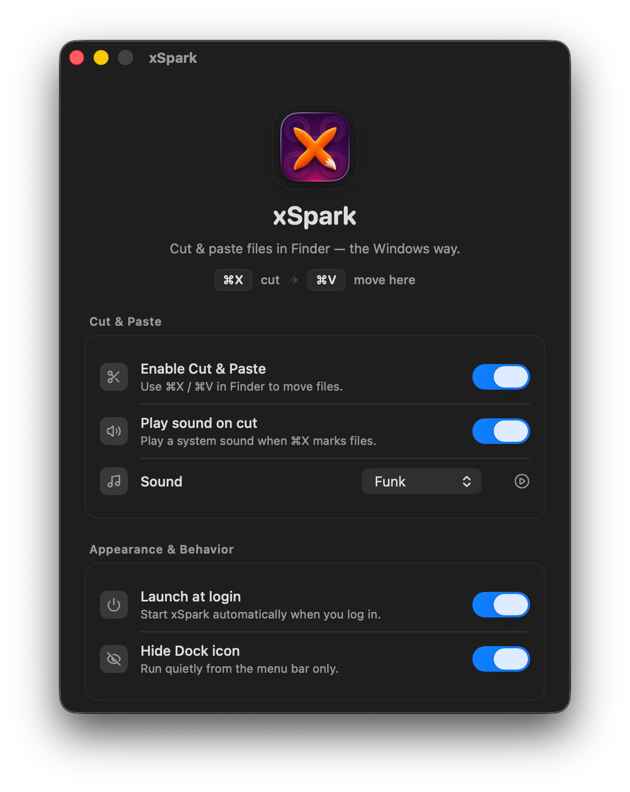

# xSpark

[English](README.md) | 繁體中文

一款免費開源的 macOS 選單列工具，幫 Finder 補上原生從未支援的 **剪下貼上（⌘X / ⌘V）搬移檔案** 功能。

按 **⌘X** 標記要搬移的檔案，再按 **⌘V** 貼到新位置，操作邏輯就跟 Windows 檔案總管一樣。xSpark 是透過模擬 Finder 原生的「移到這裡」指令來完成搬移，完全原生、安全，不會有自訂檔案操作造成的資料遺失風險。

## 為什麼會有 xSpark

xSpark 原本是 **[MenuSpark – 右鍵選單工具](https://apps.apple.com/tw/app/menuspark-right-click-menu/id6761634857?l=en-GB&mt=12)** 裡的一項功能，那是我做的 macOS Finder 右鍵選單擴充 App。但因為 macOS 對 Finder Sync Extension 的 Accessibility 權限範圍限制，全域 ⌘X/⌘V 快捷鍵功能沒辦法穩定跟擴充功能架構共存，所以獨立拆成這支輕量級的獨立 App。

如果你喜歡 xSpark，歡迎看看 **MenuSpark**，一套完整的 Finder 右鍵選單工具箱：快速操作、自訂選單項目、檔案工具等，全部整合在 Finder 右鍵選單裡。

👉 **[MenuSpark - Right Click Menu，Mac App Store 下載](https://apps.apple.com/tw/app/menuspark-right-click-menu/id6761634857?l=en-GB&mt=12)**

## 功能特色

- **⌘X 剪下、⌘V 貼上** — 原生 Finder 搬移行為，底層用 Finder 自己的「移到這裡」
- 只在 **Finder 為最前景視窗時** 才生效，不會攔截其他 App 裡的 ⌘X/⌘V
- 浮動 HUD 提示已剪下項目，並提醒按 ⌘V 完成搬移
- 剪下/搬移結果會有 Toast 通知
- 可選音效回饋
- 輕量選單列 App，不需 Dock icon，記憶體佔用低

## 系統需求

- macOS（Apple Silicon 與 Intel 皆可）
- Accessibility 權限（用於註冊全域快捷鍵及模擬 Finder 操作）

## 安裝方式

1. Clone 這個 repo
2. 用 Xcode 開啟 `xSpark.xcodeproj`
3. 在 **Signing & Capabilities** 選你自己的 Apple Developer Team（Automatic signing）
4. Build 並執行
5. 依提示授予 Accessibility 權限（系統設定 → 隱私權與安全性 → 輔助使用）

## 運作原理

xSpark 使用 Carbon Event Hot Key API，只在 Finder 為最前景 App 時註冊 ⌘X/⌘V：

- **⌘X**：模擬 ⌘C（複製到剪貼簿）、標記剪下狀態、顯示 HUD
- **⌘V**（剪下狀態中）：模擬 ⌥⌘V，觸發 Finder 原生「移到這裡」
- **⌘V**（非剪下狀態）：回退成一般系統貼上

所有搬移動作都是觸發 Finder 內建指令完成，xSpark 本身不做任何自訂檔案操作。

## 截圖

## 授權

MIT License，詳見 [LICENSE](LICENSE)。

---

**關鍵字：** macOS 剪下貼上、Finder 剪下貼上、Finder 搬移檔案、Finder cmd+x、macOS 檔案管理工具、Windows 風格剪下貼上 Mac、Finder 快速搬移檔案、macOS 選單列 App、MenuSpark、Finder 右鍵選單、Finder 擴充工具。
